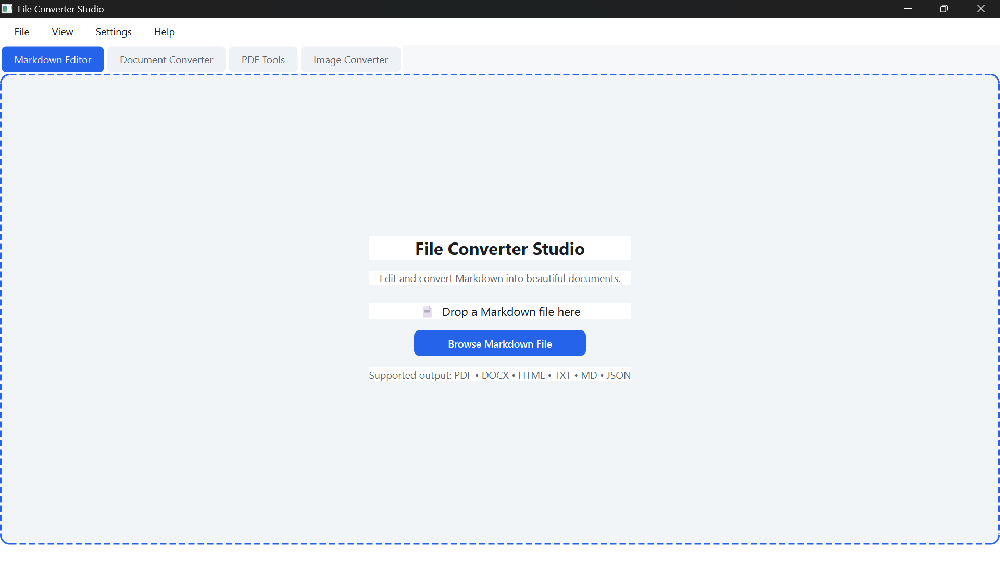
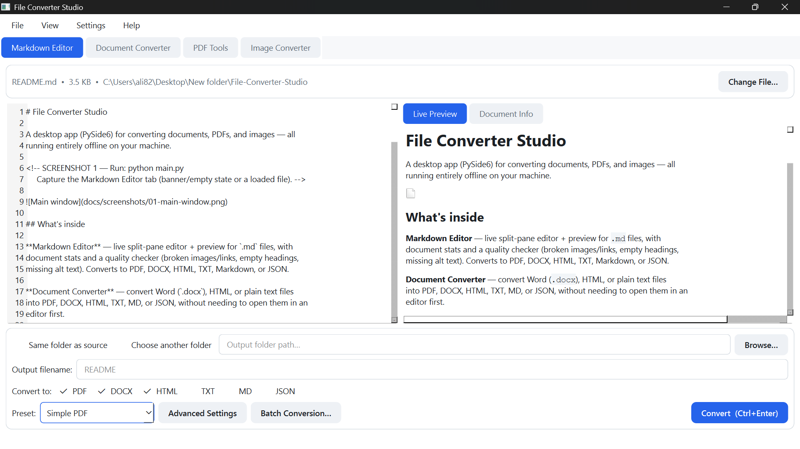
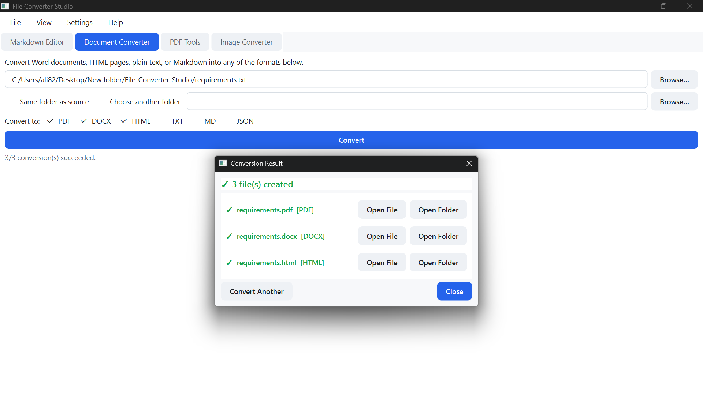
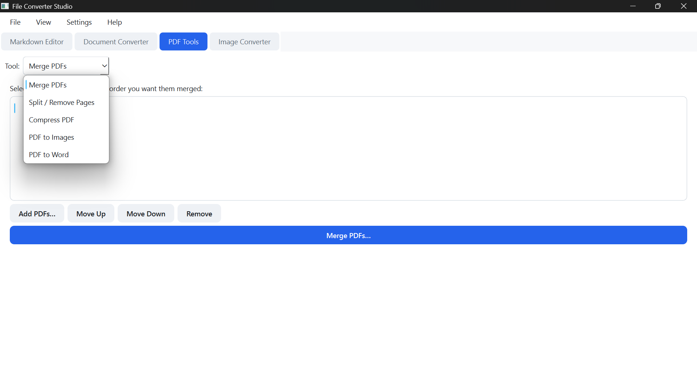
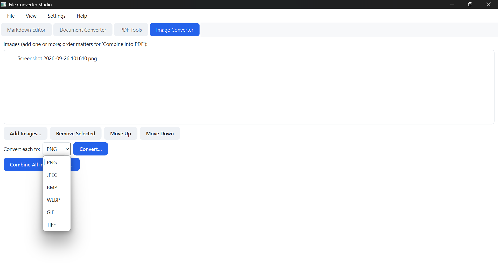

# File Converter Studio

A desktop app (PySide6) for converting documents, PDFs, and images — all
running entirely offline on your machine.

### Main Application Interface
<!-- SCREENSHOT 1 — Run: python main.py
     Capture the Markdown Editor tab (banner/empty state or a loaded file). -->



## What's inside

**Markdown Editor** — live split-pane editor + preview for `.md` files, with
document stats and a quality checker (broken images/links, empty headings,
missing alt text). Converts to PDF, DOCX, HTML, TXT, Markdown, or JSON.

**Document Converter** — convert Word (`.docx`), HTML, or plain text files
into PDF, DOCX, HTML, TXT, MD, or JSON, without needing to open them in an
editor first.

**PDF Tools** — merge PDFs, split/remove/extract pages, compress, convert
PDF pages to images, and convert PDF to an editable Word document.

**Image Converter** — convert between PNG, JPG, BMP, WEBP, GIF, and TIFF, or
combine several images into one PDF.

All conversions run on a background thread, so the UI never freezes.

<!-- SCREENSHOT 2 — Run: python main.py --start, or just load a file in the
     Markdown Editor and click Convert. Capture the result dialog. -->





<!-- SCREENSHOT 3 — Click the "PDF Tools" tab, try Merge or Split.
     Capture the PDF Tools panel. -->



<!-- SCREENSHOT 4 — Click the "Image Converter" tab.
     Capture the Image Converter panel. -->



---

## Requirements

Python 3.9+. No internet connection needed — everything runs locally.

## Installation

```bash
git clone https://github.com/alihassanazad8245/File-Converter-Studio.git
cd File-Converter-Studio
python -m venv .venv
source .venv/bin/activate      # Windows: .venv\Scripts\activate
pip install -r requirements.txt
python main.py
```

## Tests

```bash
pip install -r requirements-dev.txt
pytest
```

112 tests, all headless (Qt's offscreen platform is set automatically —
no display needed).

## Project structure

```
File-Converter-Studio/
├── main.py
├── requirements.txt
├── requirements-dev.txt
├── pytest.ini
├── tests/
└── src/markdown_converter/
    ├── engine.py, parser.py, validators.py     # document conversion core
    ├── pdf_tools.py                              # merge/split/compress/PDF↔images/PDF↔DOCX
    ├── image_tools.py                            # image format conversion, images→PDF
    ├── converters/                                 # pdf, docx, html, txt, md, json
    └── gui/                                          # main window + 4 tabs + dialogs
```

## Known limitations

- PDF export uses `xhtml2pdf` (pure Python, no system libraries needed) — a
  simpler CSS subset than a full browser engine.
- PDF → Word layout reconstruction is best-effort; complex designs may need
  minor manual cleanup.
- Compress PDF uses lossless stream compression — modest but real; not as
  aggressive as tools like Ghostscript.
- No PowerPoint support (real slide-layout rendering needs an external app
  like LibreOffice, which this project deliberately avoids depending on).

## License

MIT License. See [LICENSE](LICENSE).

---

Built by **Ali Hassan** — Instagram: [@ali_hassan8245](https://instagram.com/ali_hassan8245)
